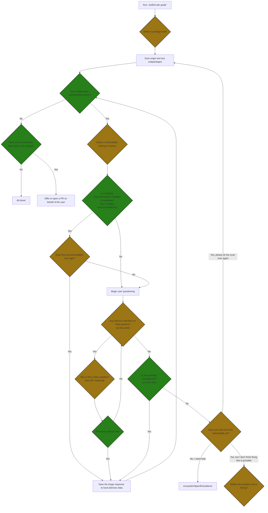

# Advisory Guide Flow

This document outlines the flow of the `wolfictl adv guide` command.

Yellow diamonds are decisions for the **user**.

Green diamonds are decisions for the **program**.

## Triaging recommendations

We could identify cases where the user shouldn't have to make any decisions, such as:

1. The fix required is not allowed by the package's version stream constraints --> `fix-not-planned` with auto-generated `note`.
1. The NVD record is marked "disputed" --> `false-positive-determination` with auto-generated `note`.
1. Govulncheck triaging confirms a false positive
1. etc...

## FP reasons

- The maintainers of the component disagree that this is a security problem.
    - Criteria: a web link for evidence
- This vulnerability is specific to another distro and not ours.
    - Don't offer FP reason if: no distro name found in CVE description
    - Criteria: select distro name that appears in the CVE description; otherwise don't allow this FP reason
- This vulnerability has already been fixed upstream.
    - Don't offer FP reason if: version range intact in vuln record
    - Criteria: a reference to a version or commit upstream for where the fix was introduced

## Nontrivial fix types

- A step of the Melange pipeline is failing
    - Criteria:
        - specify which exact step in the local package configuration file
        - provide a relevant excerpt of the error message
- A step I inserted or modified isn't having the effect I expected on the scanner results
    - Criteria: ?
