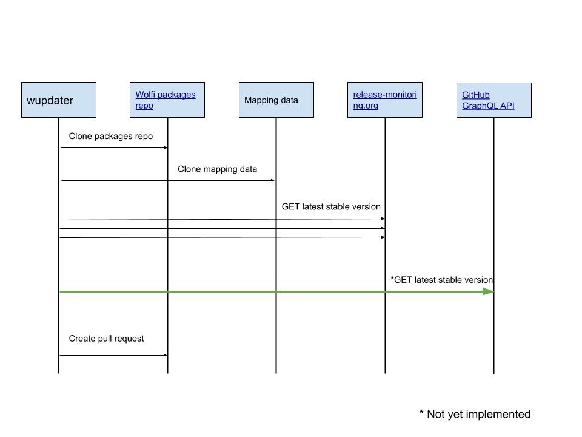

## Commands

See the [wolfictl update_command reference](https://github.com/wolfi-dev/wolfictl/blob/main/docs/cmd/wolfictl_update.md)

## Diagram



## Usage

It is expected that this CLI will be used from within a GitHub Action and interacts with the GitHub API.

This will require `contents: read` and `pull-requests: write` permissions.  For example:

```yaml
on: [ pull_request_target ]

permissions:
  contents: read
  pull-requests: write

jobs:
  triage:
    runs-on: ubuntu-latest
    steps:
      - uses: ...
        env:
          GITHUB_TOKEN: ${{ secrets.GITHUB_TOKEN }}
```

When running outside of GitHub Actions you will need to [create a personal access token](https://github.com/settings/tokens?type=beta) with Read and Write access to code and pull requests for your target git repository that contains your melange package configs.

```bash
GITHUB_TOKEN={personal access token}
```

